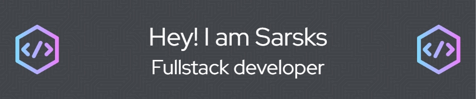

  

<h1 align="center">Hi 👋, I'm Sarsks</h1>

💻 Web Developer | 💡 Problem Solver | 🎮 Gamer at heart

  Hello! I'm Sarsks, an aspiring developer currently building a strong foundation in web programming. I'm currently focused on learning and developing applications using technologies such as:

HTML5 & CSS – to create visually appealing and responsive websites

JavaScript – to build interactive and dynamic web features

PHP & MySQL – for backend development and database management

I'm always eager to explore new frameworks and tools.

💡 I believe that growth comes from real projects, curiosity, and the passion to keep learning. I'm open to collaboration, feedback, and new challenges that can help me grow as a developer.

---

### 🚀 Skills & Technologies

  
  
  
  
  

---

### contact
   

     
     
     
   
   

---

### SNAKE

###

<!--
**Sarsks/Sarsks** is a ✨ _special_ ✨ repository because its `README.md` (this file) appears on your GitHub profile.

Here are some ideas to get you started:

- 🔭 I’m currently working on ...
- 🌱 I’m currently learning ...
- 👯 I’m looking to collaborate on ...
- 🤔 I’m looking for help with ...
- 💬 Ask me about ...
- 📫 How to reach me: ...
- 😄 Pronouns: ...
- ⚡ Fun fact: ...
-->
